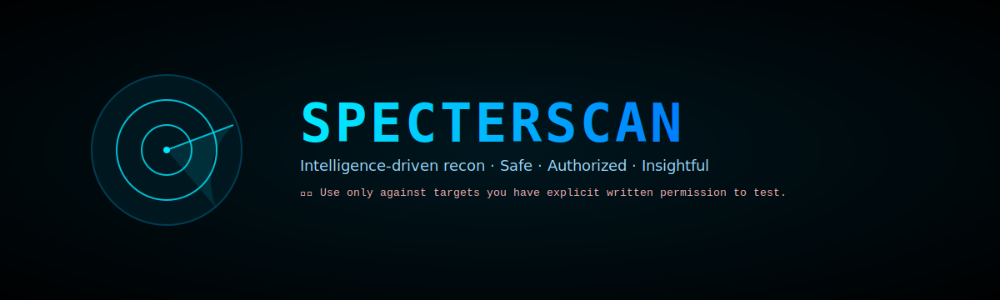

# SpecterScan

**Safe, lab-first reconnaissance toolkit — non-destructive by default.**

SpecterScan is a modular reconnaissance helper designed for **ethical hacking labs**, **CTF environments**, and **authorized penetration testing**.  
Built initially under WSL, it runs seamlessly on **Kali Linux**, **Ubuntu**, and other Debian-based distributions.

> ⚠️ **Important:** Only run SpecterScan against targets you have explicit written permission to test.  
> Unauthorized scanning is illegal and unethical. Always operate within your local laws and testing agreements.

---

## 🧠 Features

- 🕵️ **Recon Automation** – Automates common enumeration steps using trusted CLI tools (`nmap`, `whois`, `sublist3r`, etc.).
- 🧩 **Cross-Platform** – Works on WSL, Kali Linux, and most Debian-based systems.
- ⚙️ **Modular Design** – Easily expand with new commands or scanning modules.
- 🧱 **Safe by Default** – `--dry-run` mode and non-destructive defaults prevent accidental impact.
- 🧰 **Tool Awareness** – Detects which scanning tools are installed and adjusts behavior automatically.
- 🖥️ **Readable Output** – Creates organized log files and clearly labeled results in the `outputs/` folder.
- 🪶 **Lightweight** – No heavy frameworks or dependencies; pure Python and system binaries.

---

## 🚀 Quick Start

### 🔧 Install Required Tools
Make sure the common recon utilities are installed and accessible in your `$PATH`.

```bash
sudo apt update && sudo apt install -y nmap whois dig sublist3r
# Optional extras
sudo apt install -y masscan nikto dirb whatweb
